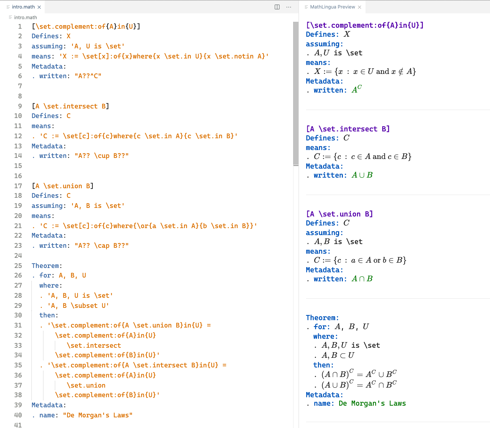

# Mathlingua Language Support

This is the official Visual Studio Code extension to provide language support for the [Mathlingua](https://www.mathlingua.org/) language.  It is the recommended tool for contributing math knowledge to the [Mathlore Vault](https://github.com/DominicKramer/mathlore-vault).

## Features

Supports syntax highlighting, auto-analysis, autocomplete, rendering of MathLingua documents (with a `.math` extension), and identifying duplicate content and signatures.  Any parse errors are displayed within the current file on save, and any signatures that are used, but have not been defined, are marked with a warning.

Furthermore, the follow command palette commands are supported:
- **mathlingua.preview**
  - Open a preview panel that renders the current MathLingua document.
- **mathlingua.duplicates**
  - Identify duplicate signatures and content in the current document.
- **mathlingua.undefined**
  - Identify signatures used in the current document that do not have a definition.

The following configuration options are also supported:
- **mathlingua.fontFamily**
  - The font used when rendering MathLingua code.
  - Defaults to the editor's font family.
- **mathlingua.scale**
  - The amount to scale the rendered MathLingua code's font.
  - Defaults to `1.5`.
- **useBoldHeaders**
  - Specifies whether or not headers in MathLingua are rendered as bold.
  - Defaults to `false`.
- **autoOpenPreview**
  - Specifies whether the preview panel should be automatically displayed when opening a `.math` file.
  - Defaults to `false`.

## Requirements

A Java virtual machine supporting Java 1.8 or higher is required to use this extension.

## Release Notes

### 0.15.0 (2020-07-14)
- Fix an issue with the display of parse errors sometimes not appearing.
- Add a preview button in the top right corner of vscode used to activate the preview of the current Mathlingua document.

### 0.14.0 (2020-07-13)
- A Mathlingua Java subprocess is now used to perform operations for the extension.

### 0.13.0 (2020-07-11)
- The `mathlingua.duplicates` and `mathlingua.undefined` commands have been added.  The identification of duplicate content and undefined signatures noew occurs when those commands are entered instead of on each file save.

### 0.12.1 (2020-07-09)
- Improve performance of detecting duplicate content and signatures.

### 0.12.0 (2020-07-08)
- Support identifying duplicate content.
- Support identifying duplicate signatures.

### 0.11.0 (2020-07-07)
- The preview panel is no longer automatically opened by default when opening a `.math` file.  The new `autoOpenPreview` option can be used to change this behavior.

### 0.10.2 (2020-07-04)
- Update the readme to describe how to use this extension with mathlore.org.

### 0.10.1 (2020-07-02)
- Address an issue where commands containing the text `is` (such as `\exists`) were not rendered correctly.
- Changed the default configuration value of `mathlingua.useBoldHeaders` to `false`.

### 0.10.0 (2020-07-01)
- Add configuration options.

### 0.9.2 (2020-07-01)
- Add autocomplete for `expands:as:`.
- Greek letters and names with subscripts are rendered correctly in TexTalk.

### 0.9.1 (2020-06-29)
- Update the preview image path in the readme.

### 0.9.0 (2020-06-29)
- Support `A??` and `A{...}??` 'written as' forms.
- Improve the spacing and rendering in the preview window.
- Fixed some issues related to opening the preview window.

### 0.8.0 (2020-06-27)
- In addition to statements, text entries, and written as entries are rendered as LaTeX.
- All text and statements have tooltips that show their original unrendered text.
- The preview window is only automatically opened if there is `.math` file open.

### 0.7.3 (2020-06-27)
- Fix an issue where named groups with multiple args are now supported.

### 0.7.2 (2020-06-26)
- The preview window is now automatically displayed when opening a `.math` file.

### 0.7.1 (2020-06-26)
- Rendered views preserve item order.
- Fixed an issue expanding "written as" forms.
- Improved font sizes.

### 0.7.0 (2020-06-25)
- Add support for rendering custom infix operators.  (For example render `x \set.in X` as `x \in X`).
- Left justify rendered html.

### 0.6.0 (2020-06-11)
- Add support for rendering MathLingua documents.

### 0.5.1 (2020-06-10)
- Update the README.

### 0.5.0 (2020-06-10)
- Updated to reflect changes to MathLingua where `Theorem` is used instead of `Result` and `Resource` is used instead of `Source`.

### 0.4.0 (2020-05-20)
- Warnings are displayed for signatures that are used but have not been defined.

### 0.3.0 (2020-05-19)
- Parse errors are now displayed within the editor on save.

### 0.2.0 (2020-05-18)
- Autocomplete of `Defines:` and `Represents:` signatures has been added but only within the current file.  That is, if a signature is specified in file `a.math`, then file `b.math` does not yet know about it.

### 0.1.1 (2020-05-17)
- Included more keywords to identify the extension

### 0.1.0 (2020-05-17)
- Introduced syntax highlighting support
- Introduced autocompletion for structural components (i.e. not statements within single quotes)
